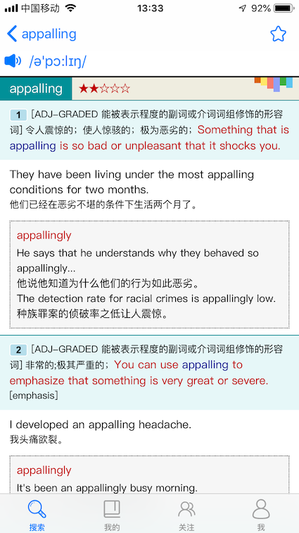
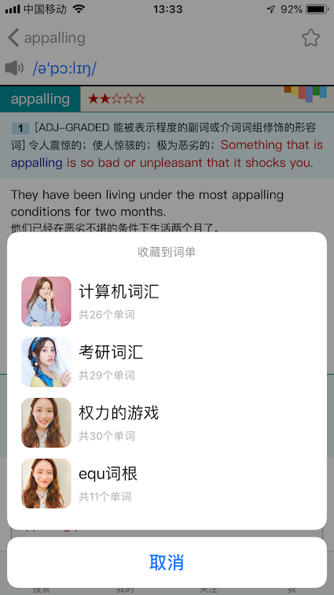
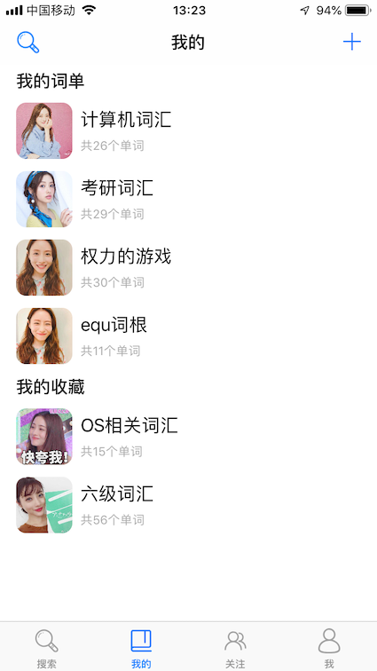
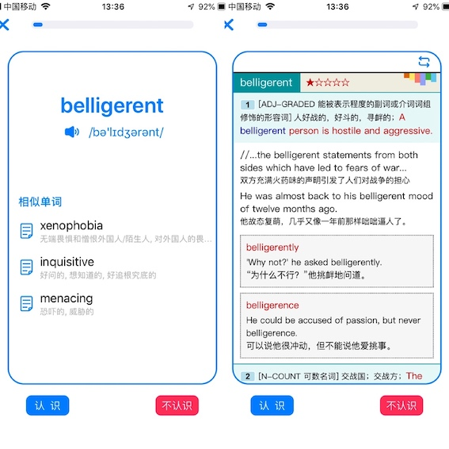

# WordChain

渣二本本科毕业设计，基于iOS背单词App（代码极烂，功能不多，慎入）

后端使用Flask RESTful框架，[后端代码传送门](<https://github.com/xiaohanhan1019/wordChain_api>)，由于不在一台电脑上开发就不合并到一个项目了。

# Feature

### 首页

上方调用了扇贝每日一句API，下方纯属充数（其实就是随机显示关注用户的词单

### 单词详细页

后端解析了柯林斯词典mdx文件，传送html及css数据到iOS端，iOS通过webview显示。
播放音频调用了金山词霸的API，右上角收藏按钮可以收藏单词到词单。

### 个人信息页

左右的滑动标签页做的有点僵硬，右上角可以修改个人信息，头像。头像将图片资源转换成`base64string`再通过接口传送给后端，后端Python将`base64string`转换为图片存储在服务器上。服务器部署了`Nginx`，使得图片资源可以通过URL来访问，所以头像只需在UIImageView加载URL图片就行了。

### 词单页

用户可以创建自己的词单，也可能收藏别人的词单（你可以将词单看作网易云的歌单，初衷就是想把词单做成歌单那样可以分享
左上角查询，右上角创建新词单。

### 词单详细页

右上角编辑键可以对词单进行信息编辑，当然只有词单创建者可以修改。
可以更改单词排序，其中按照相似度排序是基于`word2vec`词向量计算工具和`LCS最长公共子序列`，`word2vec`基于单词语义给出相似度，`LCS`基于单词形似给出相似度。这样的话，举个例子，比如你的词单中有claim，exclaim，proclaim，declaim这种形近或者义近的单词就可以连在一起（这也是起名WordChain的意义

### 学习页

单词学习页，通过在词单详细页点击`开始学习`进入。
点击单词卡片的空白部分，单词卡片会旋转，显示单词的详细页（即右边）。
下方的相似单词是基于`word2vec`推荐的，对于高频词来说，效果还是比较好的，见下图

很多代码实现的比较强行...看看就好

以上